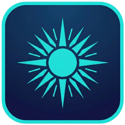

<p align="center"></p>
<h1 align="center">Hyperion</h1>
<p align="center">Use CapsLock as a Hyper modifier regardless of keyboard layout.</p>
<p align="center"><a href="README.md">Русский</a> · <a href="https://github.com/Frommer-droid/Hyperion/releases/latest">Latest release</a></p>

Hyperion is a Windows desktop app with a system tray, physical key calibration, and configurable shortcuts. A short CapsLock tap retains its normal behavior; holding it with another key sends a Hyper shortcut.

## Features

- Tap CapsLock to toggle case; hold it with a key to send `Ctrl+Shift+Alt+Win+VK_A..Z` by default.
- Map punctuation, navigation keys, NumPad 0–9, and custom F13–F24 actions.
- Calibrate physical keys by scan code, independently of the active layout.
- Exclude selected processes from interception.
- Use the system tray, One Dark theme, and saved window geometry.

## Install

Download the Windows installer from [GitHub Releases](https://github.com/Frommer-droid/Hyperion/releases/latest). The packaged app requires Windows 10/11 x64. The standard installation under `D:\Apps\Hyperion` (or `C:\Apps\Hyperion` without a D: drive) requires administrator privileges.

## Run from source

Python 3.11+ is required; development uses Python 3.12.

```powershell
py -3.12 -m venv .venv
.\.venv\Scripts\python.exe -m pip install -r requirements.txt
.\.venv\Scripts\python.exe run.py
```

Open the **Keys** tab to calibrate a physical key and assign an action. Calibration is saved in `config.json`; window and startup settings are stored in `settings.json`.

## Develop

```powershell
.\.venv\Scripts\python.exe -m pip install -r requirements-build.txt
.\.venv\Scripts\python.exe -m pytest
.\.venv\Scripts\python.exe -m ruff check .
```

See [DEVELOPER.md](DEVELOPER.md) for architecture and release commands and [RELEASE_NOTES.md](RELEASE_NOTES.md) for changes.

## License

Hyperion is licensed under the [MIT License](LICENSE). PySide6/Qt notices are in [THIRD_PARTY_NOTICES.md](THIRD_PARTY_NOTICES.md).
